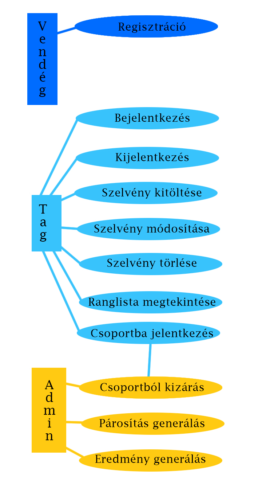
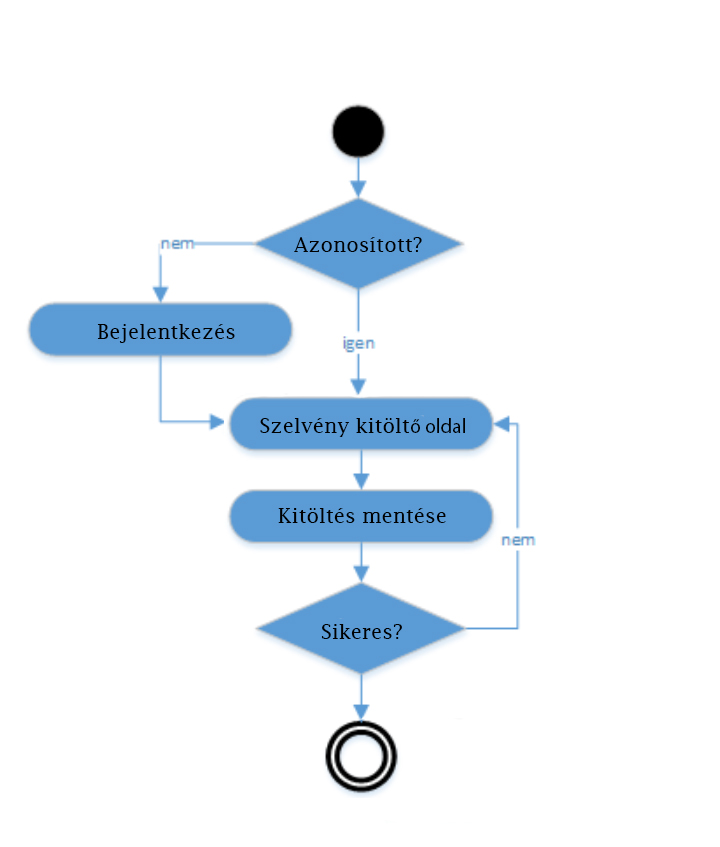

# Alkalmazások fejlesztése
## 1. mérföldkő
Takács László Kristóf – DSDUY3
Kormányos Zsolt Marián – T05AI1
# Tippmix
## Projekt általános leírása:
Egy leegyszerűsített fogadó irodát valósít meg az oldal
Regisztráció után a tagoknak lehetőségük lesz szelvényeket kitölteni. 
Egy szelvényen 5 mérkőzés van, a mérkőzéseket mindig ugyanaz a 10 csapat játssza, a mérkőzések párosítása véletlenszerű, amely fordulónkét változik.
A mérkőzések eredménye véletlenszerű.
A tagok az eltalált meccsekért pontokat kapnak.
Minden fordulóban az első szelvény kitöltése ingyenes a tagoknak, a további szelvények kitöltéséért pontokat kell fizetniük.
A tagoknak lehetőségük van csoportokba jelentkezni, ahol a csoport többi tagjával versenyezhetnek a pontszámaik alapján, egy ember több csoportba is jelentkezhet.
A meccsek eredményeit és a következő forduló párosítását az adminisztrátor indítja el.

## Funkcionális elvárások:
* Regisztráció
* Felhasználók listázása
* Felhasználók listázása csoportonként
* Adott felhasználó szelvényeinek listázása

## Vendégek által elérhető funkciók:
* Regisztráció

## Tagok által elérhető funkciók:
* Saját szelvények böngészése
* Szelvények kitöltése, módosítása, törlése
* Csoportokba való jelentkezés és kilépés
* Jelentkezett csoportok ranglistájának megtekintése

## Adminisztrátor által elérhető funkciók:
* Aktuális forduló lezárása
* Mérkőzések eredményeinek generálása
* Következő forduló párosításának generálása
* Tag kizárása egy csoportból

Nem funkcionális elvárások:
* Felhasználóbarát, egyszerű, letisztult felület
* Jelszavas azonosítás
* Jelszavak biztonságos tárolása

Szakterületi fogalomjegyzék:
* Szelvény: A felhasználó ezen adhatja meg a tippjeit az adott forduló mérkőzéseire
* Forduló: 5 mérkőzés, melyen az adott 10 csapat valamilyen véletlenszerű párosításban játszanak egymás ellen
* Tipp: A felhasználó által egy mérkőzés végkimenetelére leadott választása (Hazai csapat nyer, Vendég csapat nyer, Döntetlen)

## Use-case modell:
### Szerepkörök:
Vendég: Nem regisztrált látogató, lehetősége van regisztrációra
Tag: Regisztrált és bejelentkezett látogató, lehetősége van szelvényeket kitölteni és csoportokba jelentkezni
Adminisztrátor: Fordulók párosításának generálása, eredmények generálása, tagok kizárása csoportokból

### Use-case modell:

### Szelvények kitöltésének menete:

